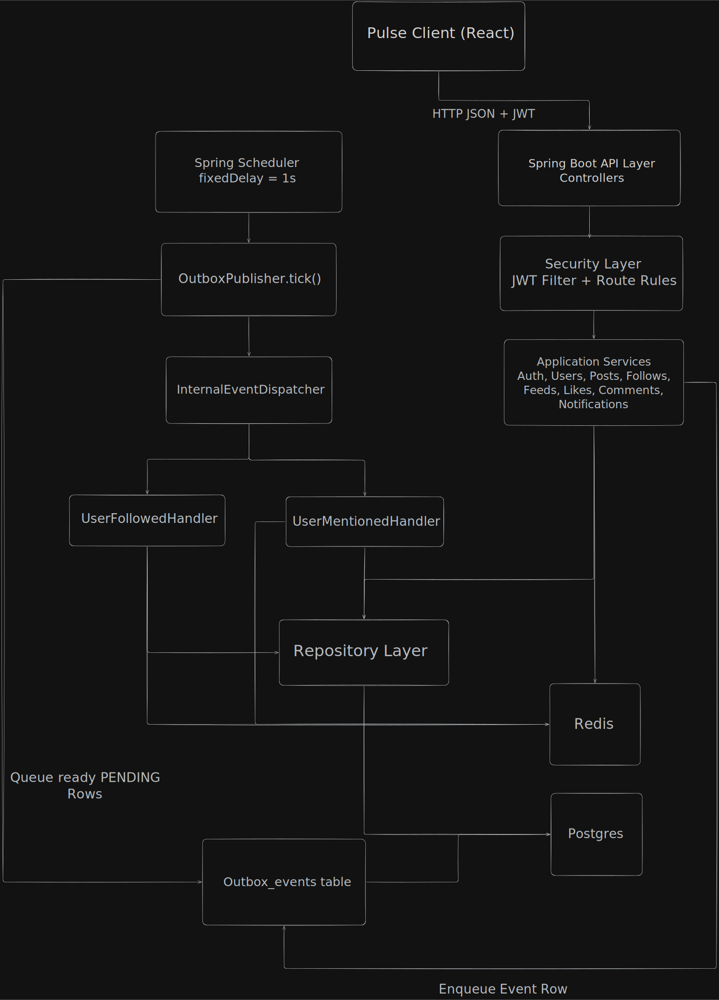
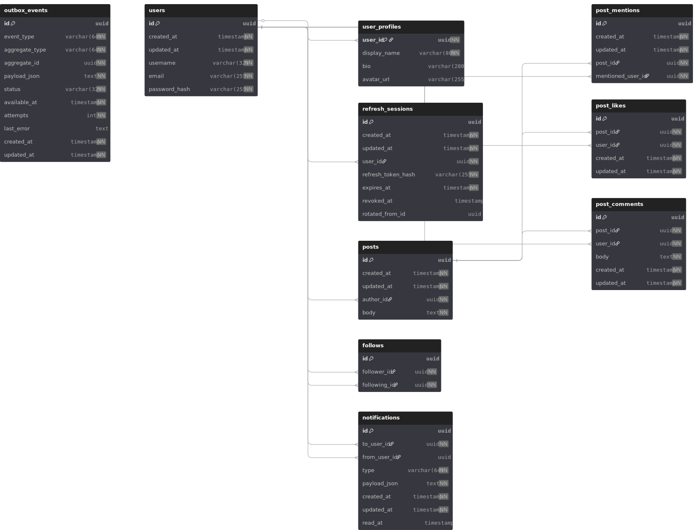

# Pulse Server (Backend API)

## Overview
Pulse Server is a portfolio backend for a social feed application. It provides authentication, user profiles, posts, follows, likes, comments, feed queries, and notifications. The service is designed with modular domain boundaries (`api`, `app`, `domain`, `infra`) and uses an outbox pattern for async event handling. It prioritizes clear service-layer logic, cursor pagination, and practical caching for common read paths.

[Design Diagram](https://excalidraw.com/#json=ljYo1tF4dMUMdEeavE0K7,m059N-P6Cx92pD3izitOsQ
)

## Tech Stack
- Backend: Java 21, Spring Boot 4, Spring Web, Spring Security
- Data Access: Spring Data JPA, PostgreSQL, Flyway
- Caching: Redis
- Auth: JWT access tokens + DB-backed refresh sessions (HTTP-only cookies)
- Tooling & Tests: Maven, Testcontainers, Spring integration tests

## Core Features
- Auth: register, login, refresh token rotation, logout, current user (`/auth/me`)
- User profiles: public profile fetch + authenticated profile update
- Posts: create/get post, mentions parsing (`@username`), user post listing with cursor pagination
- Social graph: follow/unfollow, follower/following counts
- Feeds: explore feed and following feed with cursor pagination
- Engagement: like/unlike posts, add/list comments
- Notifications: list, mark one read, mark all read, unread count
- Async events: outbox + scheduled publisher for follow/mention notifications

## Architecture Overview
### API & Data Flow
1. Controllers validate/authenticate request and delegate to application services.
2. Services enforce business rules and persist through repositories.
3. Domain actions that should be async (follow/mention notifications) are written to `outbox_events`.
4. Scheduled publisher reads pending outbox rows, dispatches handlers, retries with backoff on failure.

### Module Structure
- `modules/*/api`: HTTP endpoints + DTOs
- `modules/*/app`: business logic
- `modules/*/domain`: JPA entities and enums
- `modules/*/infra`: repositories + infrastructure glue
- `common/*`: security, cache, pagination, exception handling, config

### Caching Strategy
- Redis cache for selected read-heavy endpoints (profile reads, first-page feeds/user-posts, notification unread counts)
- Short TTL-based caching with explicit invalidation on write paths where needed
- Cache keys follow explicit prefixes (for example `feed:explore:*`, `user:profile:*`, `notif:unread:*`)

## Eventing & Notification Processing
- Outbox table stores internal domain events with status, attempts, and availability time.
- A scheduled publisher polls pending rows, dispatches by event type, and marks `DONE`/`FAILED`.
- Failures are retried with bounded exponential backoff.
- Current handled events: `USER_FOLLOWED`, `USER_MENTIONED`.

## Database Design

- UUID primary keys across core tables.
- Auditable entities share `created_at` / `updated_at` via a base entity.
- Key tables:
  - `users`, `user_profiles`
  - `refresh_sessions`
  - `posts`, `post_mentions`
  - `follows`
  - `post_likes`, `post_comments`
  - `notifications`
  - `outbox_events`
- Flyway migrations are versioned under `src/main/resources/db/migration`.

## Tradeoffs & Future Improvements
- Tradeoff: internal scheduler-based outbox is simple and reliable for a single service, but not a full external message broker setup.
- Tradeoff: feed queries are straightforward SQL pagination, not precomputed fan-out timelines.
- Tradeoff: cache strategy is pragmatic (short TTL + manual invalidations), not a full cache coherence system.
- Improvement: add stronger observability (structured logs, tracing, outbox metrics dashboard).
- Improvement: add more granular authorization and rate limiting.
- Improvement: extend notification domain (more event types, richer payload contracts, delivery channels).
- Improvement: expand test coverage for notification/event failure paths and edge-case pagination.

## Getting Started
1. Prerequisites:
   - Java 21+
   - Docker + Docker Compose
2. Start infrastructure:
   - `docker compose up -d`
3. Run the app:
   - `./mvnw spring-boot:run`
4. API defaults:
   - App: `http://localhost:8080`
   - Swagger UI: `http://localhost:8080/swagger`
5. Test suite:
   - `./mvnw test`

## Notes
- Local profile defaults use:
  - Postgres: `jdbc:postgresql://localhost:5432/pulse`
  - Redis: `localhost:6379`
- If you run multiple local Postgres instances, ensure port/user alignment with `application.yml` and `docker-compose.yml`.
